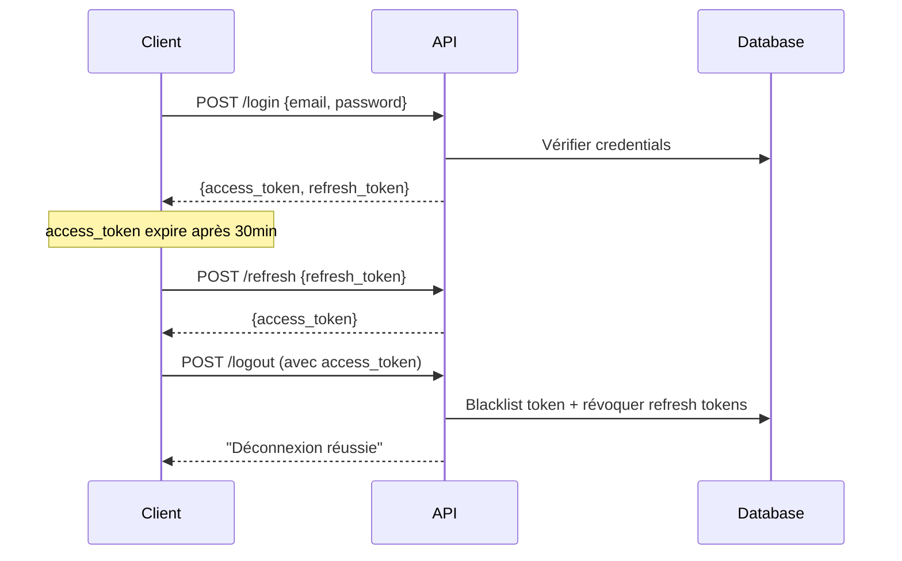

# 🔐 Authentification JWT - Documentation

## Vue d'ensemble

L'API Pronoscore utilise **JSON Web Tokens (JWT)** pour l'authentification avec support complet : refresh tokens, blacklist, reset password et vérification email.

---

## Endpoints

### 🔓 Endpoints Publics

| Endpoint                         | Description                                    |
| -------------------------------- | ---------------------------------------------- |
| `POST /auth/register`            | Créer un compte (envoie email de vérification) |
| `POST /auth/login`               | Connexion (retourne access + refresh token)    |
| `POST /auth/refresh`             | Renouveler l'access token                      |
| `POST /auth/forgot-password`     | Demander reset password                        |
| `POST /auth/reset-password`      | Réinitialiser le mot de passe                  |
| `GET /auth/verify-email/{token}` | Vérifier l'email                               |

### 🔒 Endpoints Protégés

| Endpoint            | Description                   |
| ------------------- | ----------------------------- |
| `GET /auth/me`      | Infos utilisateur connecté    |
| `POST /auth/logout` | Déconnexion (blacklist token) |

---

## Flux d'Authentification



---

## Exemples de Requêtes

### Login

```bash
curl -X POST http://localhost:8000/api/v1/auth/login \
  -H "Content-Type: application/json" \
  -d '{"email": "user@example.com", "password": "pass123"}'
```

**Réponse** :

```json
{
  "access_token": "eyJ...",
  "refresh_token": "eyJ...",
  "token_type": "bearer"
}
```

### Refresh Token

```bash
curl -X POST http://localhost:8000/api/v1/auth/refresh \
  -H "Content-Type: application/json" \
  -d '{"refresh_token": "eyJ..."}'
```

### Accès Protégé

```bash
curl -X GET http://localhost:8000/api/v1/auth/me \
  -H "Authorization: Bearer <access_token>"
```

---

## Configuration (.env)

```env
# JWT
SECRET_KEY=<secrets.token_hex(32)>
ALGORITHM=HS256
ACCESS_TOKEN_EXPIRE_MINUTES=30
REFRESH_TOKEN_EXPIRE_DAYS=7
PASSWORD_RESET_EXPIRE_HOURS=1

# SMTP (pour emails)
SMTP_HOST=smtp.gmail.com
SMTP_PORT=587
SMTP_USER=your-email@gmail.com
SMTP_PASSWORD=your-app-password
FROM_EMAIL=noreply@pronoscore.com
FRONTEND_URL=http://localhost:3000
```

---

## Structure des Fichiers

```
backend/app/
├── core/
│   ├── config.py      # Configuration
│   ├── security.py    # Génération tokens JWT
│   └── email.py       # Service SMTP emails
├── middleware/
│   └── auth.py        # get_current_user() + blacklist
├── models/
│   ├── user.py        # User + email_verified
│   └── token.py       # RefreshToken, TokenBlacklist
├── controllers/
│   └── auth_controller.py
└── api/v1/routes/
    └── auth.py
```

---

## Sécurité

- ✅ Mots de passe hashés avec **bcrypt**
- ✅ Tokens signés avec **HS256**
- ✅ Refresh tokens en base de données
- ✅ Blacklist pour invalidation réelle des tokens
- ✅ Vérification email à l'inscription
- ✅ Reset password sécurisé par email

---

## Protéger une Route

```python
from middleware.auth import get_current_user
from models.user import User

@router.get("/protected")
async def protected_route(current_user: User = Depends(get_current_user)):
    return {"message": f"Bonjour {current_user.username}"}
```
